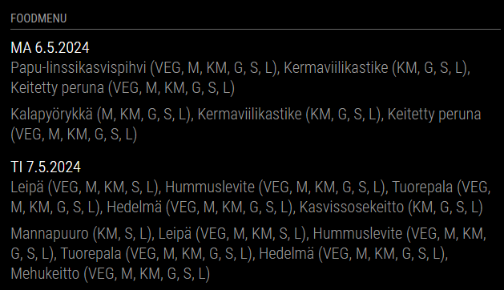

# Module for [MagicMirror](https://magicmirror.builders/): Ruuvi api sensors

The `MMM-aromi-foodmenu` module fetches Ruuvi sensors data from User API (https://docs.ruuvi.com/communication/cloud/user-api).


## Screenshot



## Using the module

1) Clone this repository under `MagicMirror/modules` folder
2) Run `npm install` in `MagicMirror/modules/MMM-aromi-foodmenu` folder
3) Add to the modules array in the `MagicMirror/config/config.js` file:
````javascript
modules: [{
	module: "MMM-aromi-foodmenu",
	position: "top_right",
	header: "Foodmenu",
	config: {
        updateInterval: 5 * 1000 * 60, // every 5 minutes
        url: 'https://aromimenu.cgisaas.fi/VantaaAromieMenus/FI/Default/Vantti/VierumakiKO/Rss.aspx?Id=9594d033-482f-4f9d-b369-307fa37223db&DateMode=1'
	}
}]
````

## Configuration options

The following properties can be configured:


| Option                       	| Default value               | Description
| -----------------------------	| --------------------------- | -----------
| `updateInterval`				| `3600000`                     | Update interval in milliseconds. Limited minumum value for 1 minute becau60*1000se API blocks faster updates.
| `url`						    | `https://aromimenu.cgisaas.fi/VantaaAromieMenus/FI/Default/Vantti/VierumakiKO/Rss.aspx?Id=9594d033-482f-4f9d-b369-307fa37223db&DateMode=1` | Aromi foodmenu RSS url
